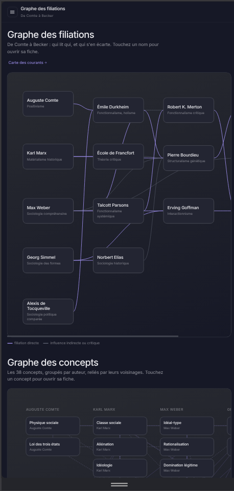
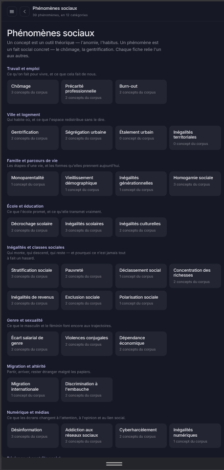

# Sociologor

**La sociologie, reliée.** Quinze fiches — quatorze auteurs et l'École de
Francfort — leurs concepts expliqués simplement, leurs œuvres, et le graphe de
leurs filiations. Application web progressive, consultable hors connexion.

## Ce que c'est

Une PWA React + Vite, sans compte, sans serveur applicatif et sans collecte de
données. Tout le contenu — 15 fiches, 32 domaines, 38 concepts, 15 courants,
39 phénomènes sociaux, 10 processus sociaux, 43 œuvres, et la documentation
utilisateur — est embarqué dans le bundle et mis en cache par un service
worker.

| Écran | Contenu |
|---|---|
| Accueil | Notion du jour (rotation sur les 38 concepts) et les 32 domaines, en 8 familles |
| Domaine | Les auteurs de référence d'un thème, avec un paragraphe de contexte |
| Fiche auteur | Repères, concepts, filiation, œuvres, citations, critiques, bibliographie |
| Graphe | Filiations entre les 15 fiches, et réseau des 38 concepts |
| Carte des courants | 15 courants — paradigme, courant, école, variante — reliés par leurs filiations |
| Phénomènes sociaux | 39 faits sociaux concrets, chacun relié aux concepts du corpus qui l'éclairent |
| Processus sociaux | 10 trajectoires en étapes, reliées aux phénomènes qu'elles produisent |
| Recherche | 145 entrées, insensible aux accents, filtrable par type |
| Mes fiches | Les fiches épinglées, conservées sur l'appareil |
| Paramètres | Affichage, données locales, mise à jour forcée, à propos |
| Documentation | 53 pages, sommaire en accordéon, recherche plein texte |
| Menu ☰ | Toutes les fonctionnalités, classées par catégorie |

Export Markdown d'une fiche, partage de son lien, bandeaux d'état réseau et de
mise à jour, avertissement légal au premier lancement.

## Aperçu

<table>
<tr>
<td width="25%"></td>
<td width="25%"></td>
<td width="25%"></td>
<td width="25%"></td>
</tr>
<tr>
<td align="center">Accueil</td>
<td align="center">Graphe</td>
<td align="center">Carte des courants</td>
<td align="center">Phénomènes sociaux</td>
</tr>
</table>

## Démarrer

```bash
cd app
npm install
npm run dev
```

Le service worker n'est actif que sur le build de production :

```bash
npm run build && npm run preview
```

## Vérifier

```bash
npm run verify   # audit documentaire + build + parcours navigateur
```

L'audit documentaire (`npm run doc:audit`) fait échouer le build si une page du
sommaire n'a pas de contenu, si un lien interne est cassé, si le code joint un
hôte externe absent des textes légaux, ou si une clé de stockage n'est pas
documentée.

## Déploiement

Le build produit `app/dist/`, avec un `404.html` identique à `index.html` pour
que les adresses profondes (`/a/bourdieu`) fonctionnent sur un hébergeur
statique. Hébergement prévu : Netlify. HTTPS obligatoire — sans quoi le service
worker ne s'installe pas.

## Origine

L'interface a été maquettée dans Claude Design ; le bundle d'origine est
conservé tel quel dans `sociologor-pwa-prototype/` à titre de référence.
Le contenu des fiches a été extrait mécaniquement de ce prototype vers
`app/src/data/authors.js`.

> Note : `sociologor-pwa-prototype/project/github.md` est un fichier du bundle
> de maquettes et n'a pas été mis à jour ; ses chiffres (12 fiches) datent d'une
> version antérieure du prototype. Les chiffres qui font foi sont ceux du
> présent dépôt.

## Documentation

La documentation utilisateur vit dans `app/docs/` et se lit dans
l'application, à l'écran **Documentation**. Le standard qu'elle applique est
`DOCUMENTATION_SPEC.md`.

## Licence et mentions

Éditeur : Swinux — Canton de Vaud, Suisse — contact@swinux.ch.
Voir les mentions légales dans l'application.
